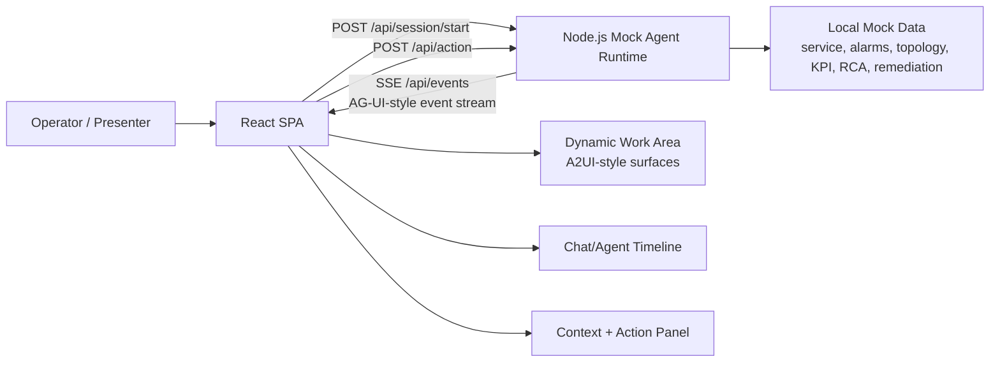
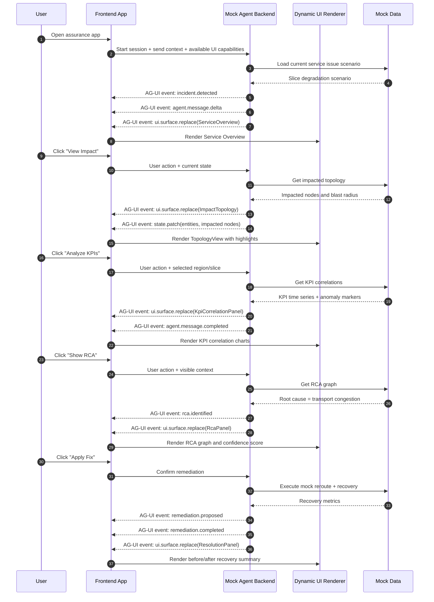

# Agent-First Assurance Demo (Mock EDC)

A conference-friendly mock demo that contrasts:
1. **Traditional chatbot bolted onto UI** (left timeline only), and
2. **Agent-first UI** where the backend runtime **actively composes surfaces** in the center panel.

The story simulates a 5G **Enterprise Surveillance Slice** incident, progressing from detection to impact, KPI correlation, RCA, remediation, and recovery.

## What is AG-UI vs A2UI in this demo?

- **AG-UI-style event stream (runtime interaction layer):**
  - Implemented over **SSE** from backend `/api/events`.
  - Event types include: `session.started`, `incident.detected`, `agent.message.*`, `ui.surface.replace`, `state.patch`, `rca.identified`, `remediation.*`, and tool invocation events.
- **A2UI-style UI schema (declarative dynamic UI model):**
  - Carried as JSON payload in `ui.surface.replace` events.
  - Example shape:

```json
{
  "surface": "impact-topology",
  "title": "Impact Topology",
  "component": "TopologyView",
  "props": { "nodes": [], "edges": [], "blastRadius": {} }
}
```

> AG-UI-style events transport and coordinate runtime behavior. A2UI-style payloads describe *what* interface to render.

## Architecture



## Guided sequence



## Folder layout

- `backend/` – Node.js + TypeScript mock agent runtime with deterministic scripted behavior.
- `frontend/` – React + TypeScript single-page UI.
- `backend/src/data/mockData.ts` – local mock service, alarms, topology, KPIs, RCA, remediation, recovery data.

## Run locally

From `assurancedemo/`:

```bash
npm install
npm run dev
```

- Frontend: `http://localhost:5174`
- Backend: `http://localhost:8787`

Or run each side separately:

```bash
npm run dev:backend
npm run dev:frontend
```

## Live demo script

1. Start on **Service Overview** and narrate initial incident detection.
2. Use whichever action the agent recommends first (typically **View Impact**), and mention that one or two additional context-aware options are generated each step.
3. Move through the investigation path (**Analyze KPIs** then **Show RCA**) while calling out how recommended actions adapt after every response.
4. Trigger **Apply Fix** once remediation is recommended.
5. End on **Resolution Summary** and optionally follow one of the newly suggested follow-up actions to validate recovery from a different view.

> Presenter note: the old **Reset Demo** control has been removed. Restart by refreshing the app (or starting a new session) when you want to replay from step one.

## Mixed-component query examples

The operator input supports composed queries that can request more than one component at once.

- "show me the RCA with the KPIs ( drop rate, packet loss)"
- "show me the Impact Topology with the KPI ( packet loss )"
- "display the Impact Topology and include the KPI ( packet loss )"
- "I want the Impact Topology together with the KPI ( packet loss )"

## Non-goals

- No real telco integrations
- No real AG-UI/A2UI certification
- No auth/persistence/production hardening
